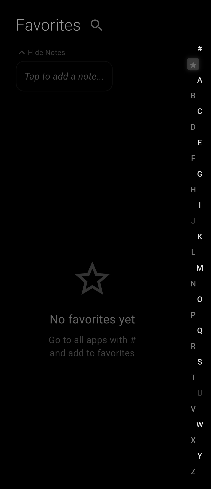
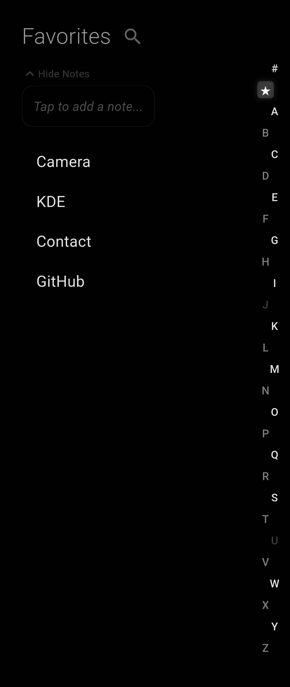

#  <h3>Wiki Launcher</h3>

A minimal, sorted Android launcher built with Flutter. Clean, fast, and privacy-focused.

> Pure black OLED design · No ads · No tracking · Open source

---

## Overview

Wiki Launcher provides a simple and distraction-free home screen experience. Apps are organized alphabetically, search is fast, and favorites stay easily accessible.

## Features

| Feature | Description |
|---|---|
| Alphabet Navigation | Fast app access through alphabet-based navigation |
| Favorites | Pin and reorder your most used apps |
| Search | Quickly search across installed apps |
| Notes | Add personal notes to the home screen with bold text support |
| Hide Apps | Hide apps you do not want to see |
| Rename Apps | Set custom display names for apps |
| Settings via `/set` | Type `/set` in the search bar to open settings |
| Multi-language | Supports Turkish and English |
| OLED Black | Pure black background optimized for OLED screens |
| Wide Screen | Two-column layout for tablets and foldables |

## Screenshots

<p align="center">
  
  
</p>

## How It Works

- Home Screen: Shows your favorite apps, which can be reordered with a long press
- Pull Down: Opens the notification panel
- Back Button: Opens search
- Alphabet Sidebar: Tap a letter to filter apps
- Long Press `#`: Shows hidden apps
- Type `/set`: Opens the settings panel

## Settings

Access settings by typing `/set` in the search bar.

- Language — Switch between Turkish and English
- Show Icons — Toggle app icons on or off
- Hidden Apps — View and manage hidden apps

## Build

### Requirements

- Flutter SDK (3.10+)
- Android SDK
- JDK 17

### Steps

```bash
# Clone the repository
git clone https://github.com/dikenwiki/wiki-launcher.git
cd wiki-launcher

# Get dependencies
flutter pub get

# Build debug APK
flutter build apk --debug

# Build release APK
flutter build apk --release
```

The APK will be available at:

`build/app/outputs/flutter-apk/app-release.apk`

## Project Structure

```text
lib/
├── main.dart                  # Platform router (Android/Linux)
├── main_android.dart          # Android launcher UI
├── main_linux.dart            # Linux launcher UI
├── android_app_service.dart   # Android platform channel service
├── linux_app_service.dart     # Linux app discovery service
├── services.dart              # Shared storage services (favorites, settings)
└── app_localizations.dart     # i18n (Turkish/English)
```

## Contributing

Contributions are welcome.

- Report bugs
- Suggest features
- Submit pull requests
- Add new language translations

## License

This project is open source.
